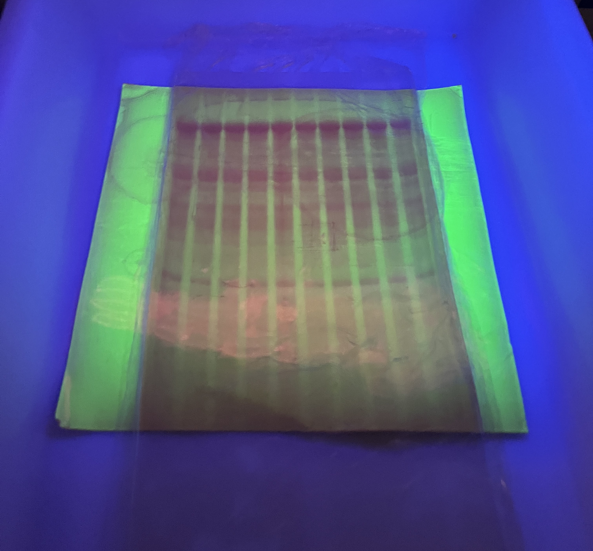
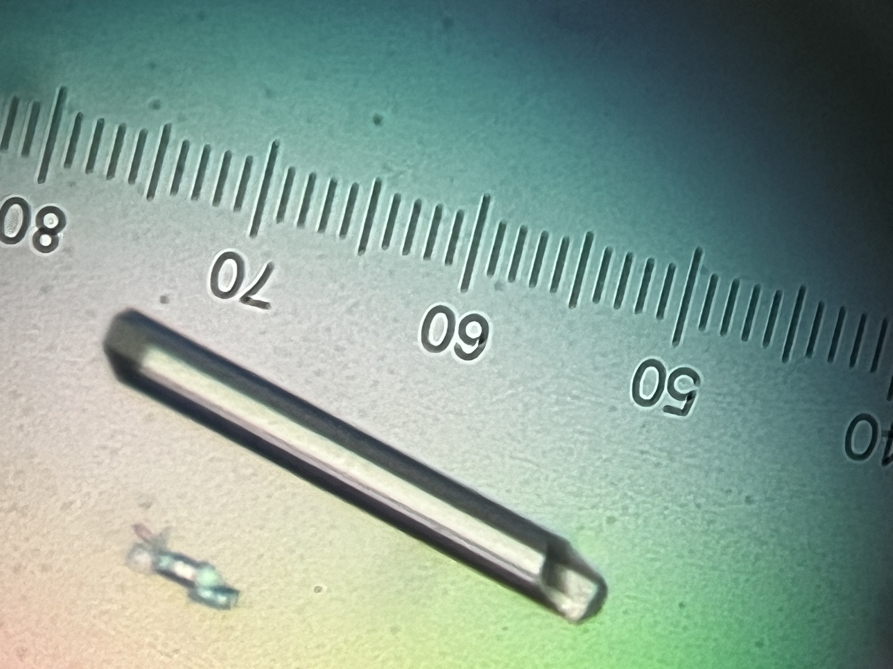

Beyond project management, I am also directly involved in the execution of scientific experiments in the laboratory. This hands-on experience gives me a strong understanding of the practical aspects behind each technique and method, including their technical challenges, time and resource requirements, and how they can be combined with complementary approaches.

Working across the full workflow, from upstream process development (USP) and downstream process development (DSP) to analytical characterization, has given me substantial experience in the prerequisites for a smooth and streamlined R&D process. I understand how each technique feeds into the next, which parameters are critical to monitor, and which quality criteria need to be maintained throughout the workflow to ensure reliable and actionable results.

This combination of project management and hands-on scientific expertise allows me to anticipate technical constraints, coordinate activities effectively, and make informed decisions throughout the development process.

## Upstream Process & Molecular Biology

I have frequently started projects at the gene level, developing the molecular biology workflows required to generate and engineer expression constructs. Thus, I am highly experienced with a range of molecular biology approaches, including **PCR-based cloning** such as QuickChange and Around-the-Horn, as well as **recombination-based cloning** approaches including Gibson Assembly and Gateway cloning. I am also proficient in **agarose gel electrophoresis** for quality control and the assessment of DNA fragments throughout the different stages of construct engineering.

The resulting constructs are used for the **heterologous expression** of target proteins. I apply **design of experiments (DoE)** and statistical analysis to systematically investigate and optimize culture conditions, with the aim of improving protein yield and productivity. My experience covers the progression from **small-scale expression screening** to larger-scale production, with process conditions adapted to the quantity and quality requirements of subsequent purification and characterization steps.

## Downstream Process

My experience covers a broad range of separation and purification strategies for isolating proteins of interest from complex biological matrices. I have hands-on experience with approaches ranging from centrifugation and filtration to selective precipitation and chromatographic purification, allowing me to design purification workflows adapted to the properties of the target protein and the characteristics of the starting material.

The matrices I have worked with have varied substantially across projects. I am particularly experienced in the purification of recombinant proteins produced in bacterial expression systems such as E. coli, as well as in protein extraction and purification from yeast biomass. I have also worked with less conventional biological matrices, including rat urine, requiring adaptation of extraction and purification strategies to the specific properties of the sample.

The proteins I have purified span a wide range of applications and molecular properties. These include enzymes used in laboratory biotechnology, such as Taq polymerase, Pfu polymerase, T7 RNA polymerase, and TEV protease, as well as human proteins investigated as potential targets in early-stage drug discovery programs. I have also worked with viral proteins from pathogens such as Measles and Hendra viruses.

This diversity of targets and starting materials has given me strong experience in designing purification strategies around the biochemical and biophysical properties of the protein of interest. I routinely integrate complementary chromatographic techniques into purification workflows, including affinity chromatography (e.g. nickel and Protein A), ion-exchange chromatography, and size-exclusion chromatography. I am comfortable adapting the sequence and operating conditions of these purification steps to balance purity, recovery, yield, and downstream requirements.

## RNA Production

{.insert_right}

My expertise spans the complete RNA production workflow, from *in-vitro* transcription and reaction optimization to RNA extraction, chromatographic purification, and preparation for downstream biophysical studies.

I perform *in-vitro* transcription using both commercial T7 RNA polymerase and recombinant T7 polymerase I produce in-house. I am experienced in optimizing the different stages of the production process, including DNA template preparation by **PCR amplification** or **plasmid linearization**, small-scale **screening of transcription conditions**, and subsequent scale-up to preparative reaction volumes. This enables the production of the quantities of RNA required for demanding downstream applications, including structural and biophysical studies and drug discovery programs.

My experience covers **RNA extraction** using phenol/chloroform phase separation, followed by purification using either **polyacrylamide gel electrophoresis** or chromatographic approaches. I routinely perform two complementary preparative chromatography workflows: denaturing **ion-exchange chromatography**, using urea and/or thermal denaturation, and native **size-exclusion chromatography** following RNA refolding by thermal annealing.

This end-to-end experience allows me to adapt RNA production strategies to the requirements of each project, from small-scale method development to preparative production of highly purified RNA for downstream structural and biophysical characterization.

## Analytical Characterization

My experience covers a broad range of analytical and biophysical techniques for characterizing proteins and RNA. I use complementary approaches to assess sample quality, stability, structural properties, and/or molecular interactions. I select analytical methods according to the specific requirements of the target molecule and the objectives of the project.

In biophysics, I have experience with stability characterization of both proteins and RNA using approaches including **UV melting**, **differential scanning calorimetry (DSC)**, **thermal shift assays (TSA/DSF)**, as well as structural characterization using **circular dichroism (CD)**, **small-angle X-ray scattering (SAXS)** and **chemical probing** (for RNA). I also perform interaction studies, using techniques such as **biolayer interferometry (BLI)**, **surface plasmon resonance (SPR)**, and/or **isothermal titration calorimetry (ITC)**.

My analytical biochemistry experience includes HPLC-based and column chromatography approaches, **including size-exclusion (SEC)**, **ion-exchange (IEX)**, and **reverse-phase (RP)** chromatography. I am also experienced with a range of electrophoretic methods, including **SDS-PAGE**, **capillary electrophoresis (CE)**. Furthermore, systematically implement **mass spectrometry** analysis as part of my protein characterization workflows. Complementary spectroscopic techniques, including **dynamic light scattering (DLS)**, and **static light scattering (SLS, SEC-MALS)**, provide additional information on molecular properties and sample quality.

This combination of analytical biochemistry and biophysical expertise allows me to cross-validate results using orthogonal techniques, identify potential issues early, and generate the analytical information required to guide purification, process development, and downstream structural or functional studies.

## Structural Characterization

{.insert_left}

I have extensive hands-on experience across the X-ray crystallography workflow, from crystallization and crystal handling to synchrotron data collection and structure determination.

I have extensive experience with the crystallization of both proteins and RNA, using a range of experimental setups including **hanging-drop** crystallization with Linbro plates and **sitting-drop** approaches with various plate formats. I am comfortable both preparing crystallization screens manually and operating automated liquid-handling platforms such as **Mosquito** and **DragonFly**. My experience covers the full crystallization process, from initial broad screening with commercial screening kits and identification of first hits to **systematic optimization** of crystal size, morphology, and diffraction quality.

I also handle **crystal harvesting and cryoprotection**, including preparation for liquid-nitrogen storage and transport. I have experience with crystal freezing using both liquid nitrogen and liquid ethane.

For diffraction experiments, I have extensive experience working with **synchrotron X-ray sources**. Although many experiments are now conducted remotely, I have had the opportunity to perform on-site experiments at SOLEIL, ESRF, and SLS. Following data collection, I am experienced in the processing and analysis of diffraction data for subsequent atomic-resolution structure determination and model building. My computational experience includes the **XDS** suite for diffraction-image processing, as well as **CCP4** and **PHENIX** for crystallographic analysis, structure determination, and model building.
