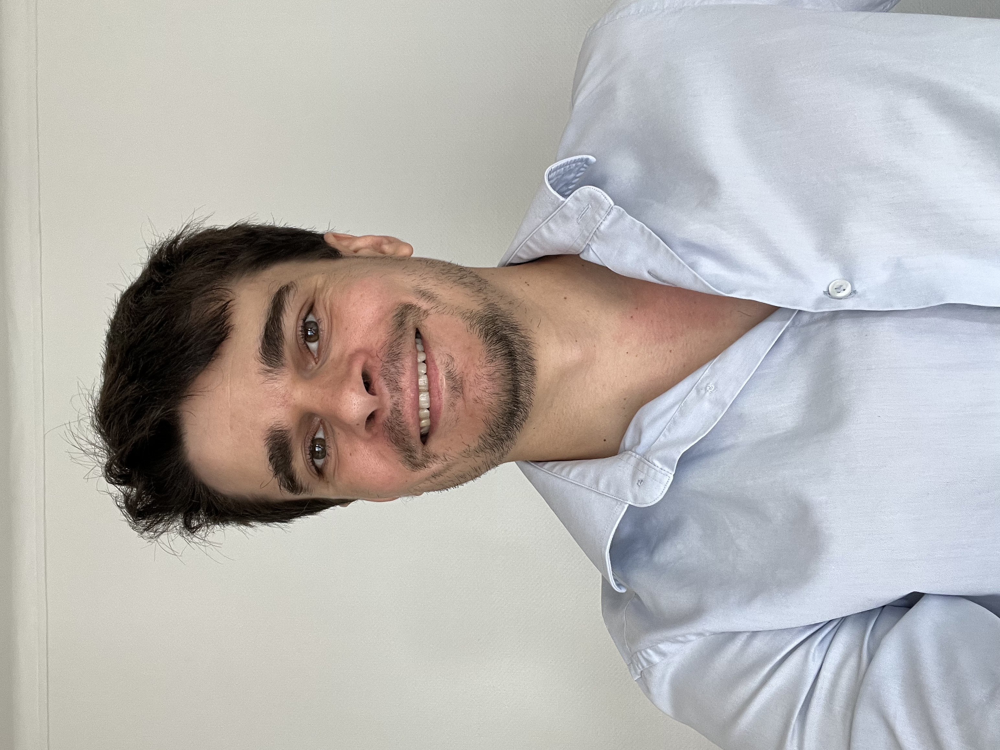

{.profile-photo}

I am a scientist with over 6 years of experience managing R&D projects in structural biology, biochemistry, and biophysics.

I combine scientific project management with hands-on experimental expertise, taking projects from initial concept and strategic planning through experimental execution and data interpretation. I am particularly experienced in designing and coordinating projects that connect molecular biology, protein production, biophysical characterization, and structural analysis.

A typical project I manage follows a *gene-to-structure* workflow, integrating upstream and downstream process development, analytical characterization, and structural characterization. This requires coordinating multidisciplinary activities, making technical and strategic decisions, and ensuring that experimental work remains aligned with the overall objectives of the project.

I am particularly motivated by:

- translating complex scientific questions into structured R&D strategies
- combining experimental and computational approaches to solve challenging problems
- bridging project strategy and technical execution
- working across disciplines and collaborating with multidisciplinary teams
