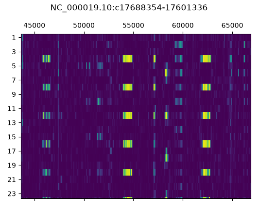
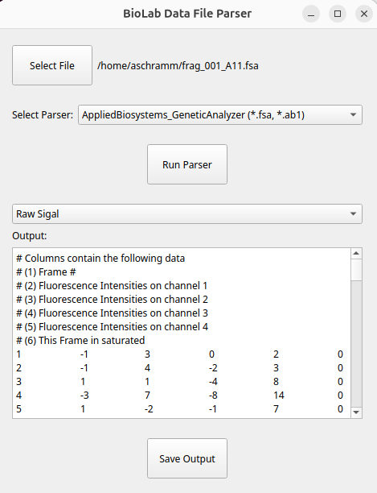

*this page is still in construction*

Alongside my project management activities, I have developed a number of tools to support and streamline my work. While these projects are not associated with formal publications, I have made several of them freely available to the scientific community.

The tools presented below address practical needs ranging from biological sequence analysis and exploration to experimental data management and processing.

## Sequence Autocorrelation

{.insert_left}

This tool provides a simple approach for identifying repeated motifs within biological sequences. The script converts a sequence from a FASTA file into an autocorrelation matrix, providing a visual representation of sequence regions that share recurring patterns.

The example shows the output for a region of the UNC13A gene, highlighting several regions made from a repeated motif.

More details are available in the dedicated [repository](https://github.com/SchrammAntoine/SequenceAutocorrelation/blob/main/README.md).

## Data file format converter

{.insert_right}

This program is a lightweight application designed to parse data files generated in biology laboratories. Through a simple graphical user interface, it enables users to quickly retrieve and convert raw experimental data into human-readable formats suitable for further analysis and visualization in tools such as Excel or GraphPad Prism.  

The application currently supports sequencing data generated using the ABIF (Applied Biosystems) file format, commonly used for Sanger sequencing.  

Its modular architecture makes the application straightforward to extend, allowing new data formats and parsing capabilities to be added as needed.  

A dedicated GitHub [repository](https://github.com/SchrammAntoine/BiolabDatafileParsersApp/blob/main/README.md) provides further details and access to the project.  

## Pymol Plugins

I've made multiple small and easy to use plugins for the structure vizualization program Pymol. These plugins are available on [Github](https://github.com/SchrammAntoine/PymolPlugins).

| Plugin       | Description                                                                                                                        |
| ------------ | ---------------------------------------------------------------------------------------------------------------------------------- |
| **afgroups** | Automatically organize AlphaFold models belonging to the same prediction into PyMOL groups.                                        |
| **findseq**  | Search protein sequences in PyMOL objects using Python regular expressions and create selections for each match.                   |
| **malign**   | Perform structural alignment of multiple mobile objects onto a common reference object.                                            |

